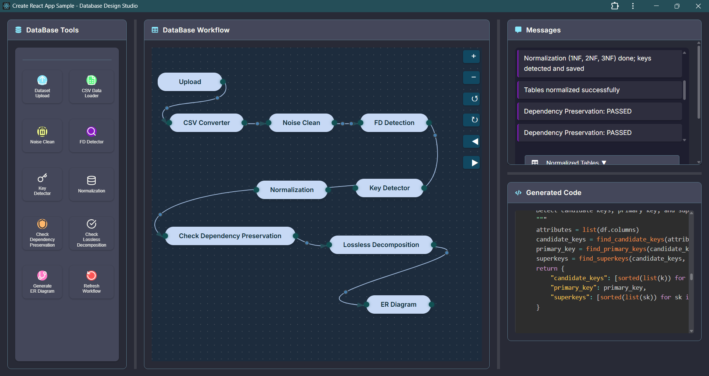
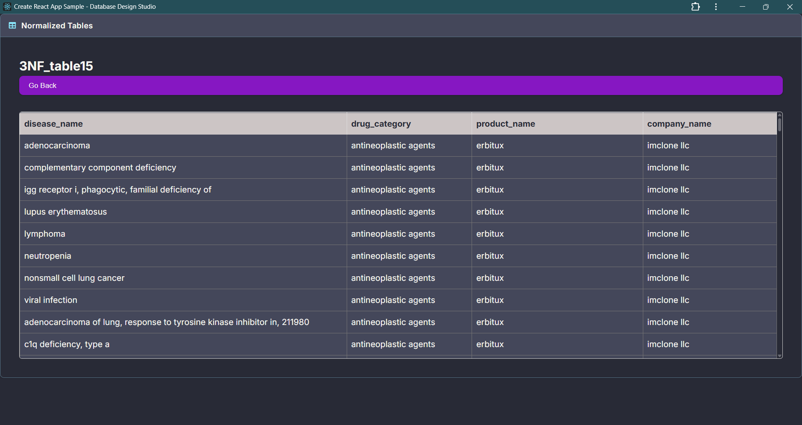

# 📊 Database Design Studio

<p align="center">
  
  
  
  
</p>

<p align="center">
  
</p>

🚀 **Database Design Studio** is a cutting-edge **full-stack application** that streamlines **database normalization**, **functional dependency detection**, **ER diagram creation**, and **workflow visualization** for both beginners and professionals.

It combines a sleek **Excel-like UI** with interactive **workflow panels**, enabling rapid database design and analysis.

---

## ✨ Key Features

| Feature                                     | Description                                                                  |
| ------------------------------------------- | ---------------------------------------------------------------------------- |
| 🔼 File Upload & Cleaning                   | Upload CSV/Excel datasets and clean them automatically                       |
| 📐 Normalization (1NF → 3NF)                | Auto decomposition with candidate keys, superkeys, and primary key detection |
| 🔍 Functional Dependency Detection          | Detect complex FDs including compound attributes                             |
| 🔄 Dependency Preservation & Lossless Check | Verify correctness of decomposition                                          |
| 📊 Excel-like Table Viewer                  | Dynamically browse and interact with normalized tables                       |
| 📜 Code Panel                               | View Python code executed for each workflow step                             |
| 🔔 Message Panel                            | Interactive logs and dropdown navigation for tables                          |
| 📌 ER Diagram Generator                     | Auto-generated ER diagrams with PK/FK detection, colors & styles             |
| 🧩 Interactive Workflow UI                  | Draggable blocks representing workflow steps connected with arrows           |

---

## 🏗️ System Architecture

```plaintext
frontend/ (React)
├── src/
│   ├── App.jsx                 # Main layout with resizable panels
│   ├── context/StateContext.jsx # Global state management
│   ├── components/             # React components
│   │   ├── ActionPanel.jsx
│   │   ├── OutputPanel.jsx
│   │   ├── CodePanel.jsx
│   │   ├── MessagePanel.jsx
│   │   ├── FileUploader.jsx
│   │   ├── TableViewer.jsx
│   │   ├── ERDiagram.jsx
│   │   └── FDViewer.jsx
│   └── api.js                  # Axios API requests
├── style.css                   # Styling and theming

backend/ (Flask)
├── app.py                      # Flask server entry point
├── cleanModify.py               # Data cleaning module
├── convert_to_csv.py            # File conversion module
├── dependency_preservation.py   # Check dependency preservation
├── er_diagram.py                # ER diagram generation
├── fd_modified.py               # Functional dependency logic
├── key_utils.py                 # Key detection utilities
├── lossless_check.py            # Lossless join algorithm
├── Normalize_1_2_3NF.py        # Normalization logic
└── processed/                   # Stores processed/normalized tables
```

---

## ⚡ Installation & Setup

### 🔹 Backend (Flask)

```bash
# Clone repository
git clone https://github.com/your-username/database-design-studio.git
cd database-design-studio

# Create virtual environment
python -m venv venv
venv\Scripts\activate   # Windows
# source venv/bin/activate # Mac/Linux

# Install dependencies
pip install -r requirements.txt

# Run server
python app.py
```

👉 Backend runs at: **[http://127.0.0.1:5000](http://127.0.0.1:5000)**

### 🔹 Frontend (React)

```bash
cd frontend

# Install dependencies
npm install

# Run React app
npm start
```

👉 Frontend runs at: **[http://localhost:3000](http://localhost:3000)**

---

## 🎨 User Interface Layout

* **Left Panel (ActionPanel)** → Select actions (Upload, Normalize, Generate ER).
* **Center Panel (OutputPanel)** → Interactive workflow with draggable steps.
* **Right Panel** → Split view: Messages + Code Panel.
* **Code Panel** → Shows Python backend code dynamically.

---

## 📸 Screenshots

<p align="center">
  
  <br/>
  
  <br/>
  
</p>

---

## 🔗 API Endpoints

```plaintext
| Endpoint                            | Method | Description                       |
| ----------------------------------- | ------ | --------------------------------- |
| `/api/upload`                       | POST   | Upload dataset                    |
| `/api/normalized_tables`            | GET    | Fetch all normalized tables       |
| `/api/get_normalized_table/<table>` | GET    | Fetch a specific normalized table |
| `/api/detected_fds`                 | GET    | Fetch functional dependencies     |
| `/api/decomposed_schemas`           | GET    | Fetch decomposed schemas          |
| `/api/dependency_preservation`      | POST   | Check dependency preservation     |
| `/api/lossless_check`               | POST   | Perform lossless join check       |
| `/api/er_diagram`                   | GET    | Generate ER diagram               |
```

---

## 👨‍💻 Tech Stack

* **Frontend** → React, React Router, Axios, Context API, React-Syntax-Highlighter, FontAwesome Icons
* **Backend** → Flask, Pandas, Graphviz, Python Utilities
* **Visualization** → Graphviz, Interactive Workflow UI
* **Database Concepts** → FD Detection, Normal Forms, Dependency Preservation, Lossless Join

---

## 👩‍💻 Contributors

<p align="center">
  <a href="https://github.com/subha-shesgin">
    
    <br/>Subha Shesgin
  </a>
  &nbsp;&nbsp;&nbsp;
  <a href="https://github.com/priX-D">
    
    <br/>Sumaiya Nazneen
  </a>
</p>

---

## 📜 License

This project is licensed under the **MIT License** – free to use, modify, and distribute.
