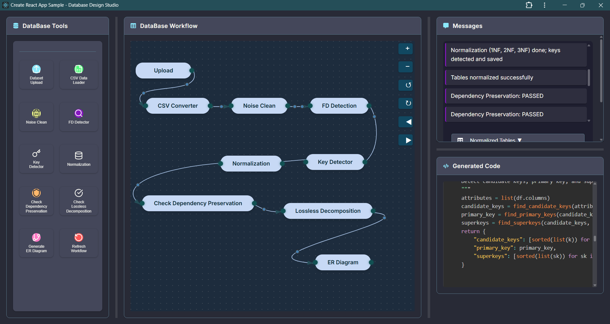
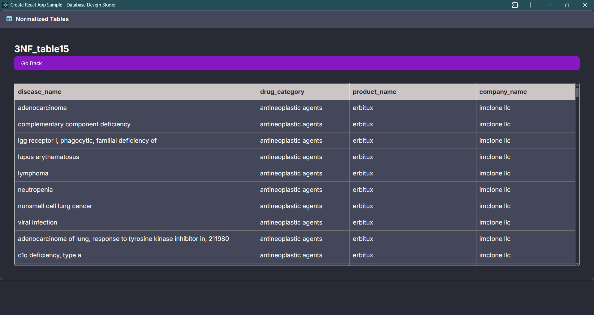

# 📊 Database Design Studio

<p align="center">
  
  
  
  
</p>

🚀 **Database Design Studio** is a full-stack application built with **Flask (backend)** and **React (frontend)** to automate **database normalization**, **functional dependency detection**, **ER diagram generation**, and **workflow visualization**.

It provides an **Excel-like UI for tables**, interactive panels for workflow management, and auto-generated **ER diagrams (Graphviz)**.

---

## ✨ Features

- 🔼 **File Upload & Cleaning** – Upload datasets (CSV/Excel) and preprocess them.  
- 📐 **Normalization (1NF → 3NF)** – Automated decomposition with candidate keys, superkeys, and primary key detection.  
- 🔍 **Functional Dependency Detection** – Auto-detect FDs with compound attributes.  
- 🔄 **Dependency Preservation & Lossless Check** – Verify correctness of decomposition.  
- 📊 **Excel-like Table Viewer** – Browse normalized tables dynamically.  
- 📜 **Code Panel** – View the executed backend code for each workflow step.  
- 🔔 **Message Panel** – See messages, logs, and interactive dropdowns for table navigation.  
- 📌 **ER Diagram Generator** – Visualize entities & relationships with PK/FK detection (colored + styled).  
- 🧩 **Interactive Workflow UI** – Draggable workflow blocks with connected flow lines.  

---

## 🏗️ System Architecture

```plaintext
frontend/ (React)
├── src/
│   ├── App.jsx                 # Main Layout with Panels
│   ├── context/StateContext.jsx # Global State Manager
│   ├── components/             # UI Components
│   │   ├── ActionPanel.jsx
│   │   ├── OutputPanel.jsx
│   │   ├── CodePanel.jsx
│   │   ├── MessagePanel.jsx
│   │   ├── FileUploader.jsx
│   │   ├── TableViewer.jsx
│   │   ├── ERDiagram.jsx
│   │   └── FDViewer.jsx
│   └── api.js                  # Axios API Calls
├── style.css                   # Styling

backend/ (Flask)
├── app.py                      # Flask App Entry
├── cleanModify.py               # Data Cleaning
├── convert_to_csv.py            # File Conversion
├── dependency_preservation.py   # Dependency Preservation Check
├── er_diagram.py                # ER Diagram Generation
├── fd_modified.py               # FD Detection Logic
├── key_utils.py                 # Key Detection Utilities
├── lossless_check.py            # Lossless Join Algorithm
├── Normalize_1_2_3NF.py         # Normalization Logic
└── processed/                   # Stores processed/normalized tables
```

---

## ⚡ Installation & Setup

### 🔹 Backend (Flask)
```bash
# Clone the repo
git clone https://github.com/your-username/database-design-studio.git
cd database-design-studio

# Create a virtual environment
python -m venv venv
venv\Scripts\activate   # On Windows
# source venv/bin/activate  # On Mac/Linux

# Install dependencies
pip install -r requirements.txt

# Run backend server
python app.py
```

👉 Flask server will run at: **http://127.0.0.1:5000**

### 🔹 Frontend (React)
```bash
cd frontend

# Install dependencies
npm install

# Run React app
npm start
```

👉 React frontend will run at: **http://localhost:3000**

---

## Live Web Application: 
[https://database-design-studio.netlify.app/](https://database-design-studio.netlify.app/)

---

## 🎨 User Interface Layout

- **Left Panel (ActionPanel)** → Select actions like Upload, Normalize, Generate ER.
- **Center Panel (OutputPanel)** → Shows workflow as draggable blocks.
- **Right Panel (Messages + Code)** → Messages with logs & dropdowns for normalized tables.
- **Code Panel** → Displays Python backend code.

---

## 📸 Screenshots

<p align="center">
  
  <br/>
  
  <br/>
  
</p>

---


## 🔗 API Endpoints

```plaintext
| Endpoint                            | Method | Description                       |
| ----------------------------------- | ------ | --------------------------------- |
| `/api/upload`                       | POST   | Upload dataset                    |
| `/api/normalized_tables`            | GET    | Fetch all normalized tables       |
| `/api/get_normalized_table/<table>` | GET    | Fetch a specific normalized table |
| `/api/detected_fds`                 | GET    | Fetch functional dependencies     |
| `/api/decomposed_schemas`           | GET    | Fetch decomposed schemas          |
| `/api/dependency_preservation`      | POST   | Check dependency preservation     |
| `/api/lossless_check`               | POST   | Perform lossless join check       |
| `/api/er_diagram`                   | GET    | Generate ER diagram               |
```

---

## 👨‍💻 Tech Stack

- **Frontend** → React, React Router, Axios, Context API, React-Syntax-Highlighter, FontAwesome Icons  
- **Backend** → Flask, Pandas, Graphviz, Python Data Utils  
- **Visualization** → Graphviz, Custom Workflow UI  
- **Database Theory** → FD Detection, Normal Forms, Dependency Preservation, Lossless Join  

---

## 👩‍💻 Contributors
- 👩‍💻 [Subha Shesgin](https://github.com/subha-shesgin)
- 👩‍💻 [Sumaiya Nazneen](https://github.com/priX-D)

---

## 📜 License

This project is licensed under the **MIT License** – feel free to use, modify, and distribute.
